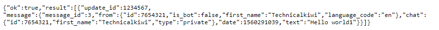

# Introduction
.

### Requirements
- Push Notifications
- Central Source for all Servers
- Notification History
- Accessible from Multiple Sources
-

# Setup
## Telegram Setup
Create Telegram account
Login to new account
### Bot setup
Start chat with BotFather
Create a new bot `/new bot`
Fill in the bots name, and username (must end with bot)
The Botfather will reply with the bots API token
Take note of this as it is vital

Go back and start a chat with your bot
### Notification setup
Go to `https://api.telegram.org/bot$TOKEN/getUpdates`
Where $ Token is the API key you received from Botfather
You should get something similar to the below

Take note of the Chat ID, in this case 7654321

### Sending Notifications
Now you have the API token and chat ID
You can send notifications by browsing to
`https://api.telegram.org/bot$TOKEN/sendMessage?chat_id=$CHATID&text=Hello+Mate`
Where `$TOKEN` is the API Token and `$CHATID` is the chat id from above
This will get the bot to send Hello Mate to your telegram account.
Check telegegram and you will have received a message in the chat from the bot.

## Server Setup
